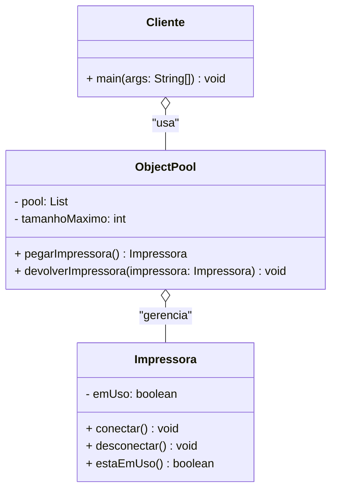

# Object Pool

## João Augusto Moura Peixoto de Jesus (20211TADSSAJ0004)
[@JoaoAugustoMPdJ](https://github.com/JoaoAugustoMPdJ)

<!-- @include: ../../../includes/seminario-1-JoaoAugustoMPdJ/README.md -->

## Salvador Cerqueira Júnior (20212TADSSAJ0020)
[@SalvadorCerqueiraJr](https://github.com/SalvadorCerqueiraJr)

<!-- @include: ../../../includes/seminario-1-SalvadorCerqueiraJr/README.md -->

## Yuri Pêpe

<figure>
  

</figure>
